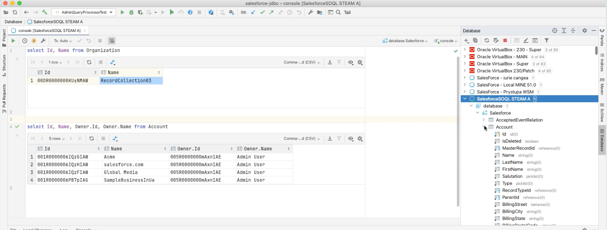
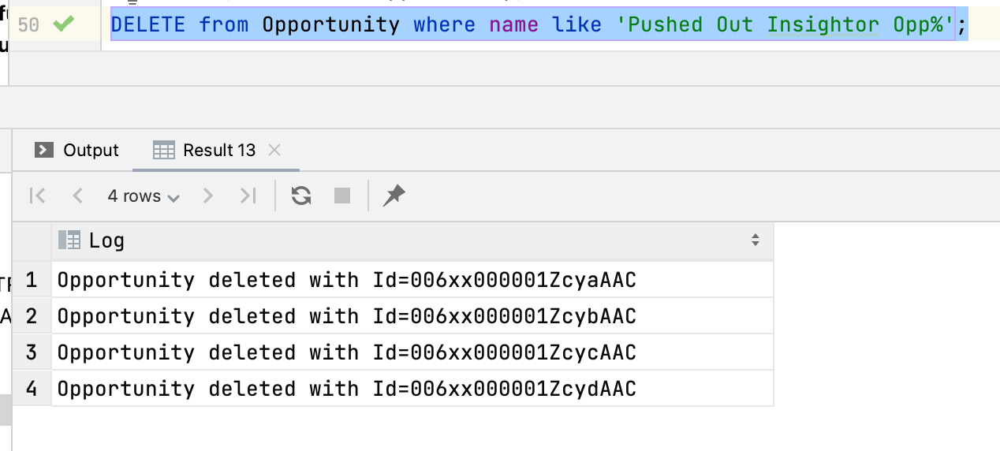
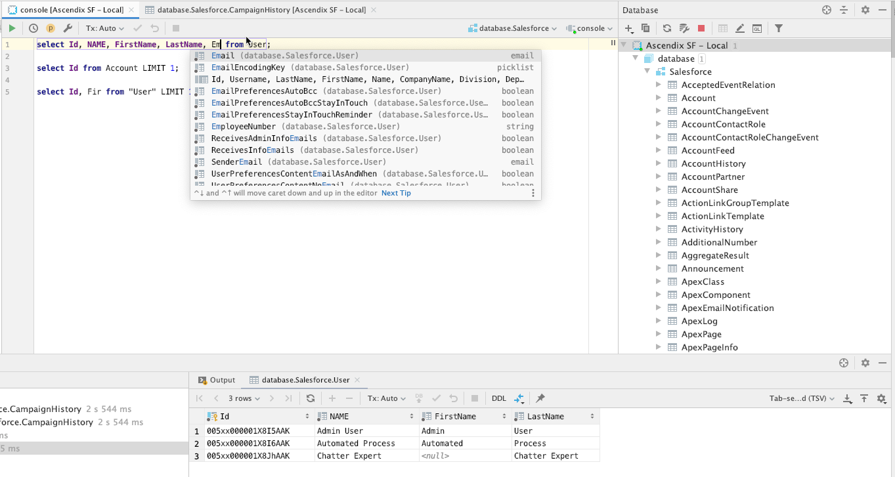

# Salesforce JDBC Driver

The Salesforce JDBC driver enables Java applications to connect to Salesforce data services using standard, database-independent Java code. It is an open-source JDBC driver written in pure Java that communicates over the SOAP/HTTP(S) protocol.

The primary purpose of this driver is to retrieve data from Salesforce services for data analysis. It is particularly optimized for use with the Eclipse BIRT engine.

This project is a fork of the [original repository](https://github.com/ascendix/salesforce-jdbc), which had compatibility issues with IntelliJ IDEA. This version addresses those limitations by implementing:
* Table and column name filtering
* Case-insensitive handling for table and column names
* Metadata support for queries, allowing IntelliJ to correctly process results

[Watch the demo video](docs/SOQL-JDBC-IntelliJ-demo-264.mp4)

[](docs/SOQL-JDBC-IntelliJ-demo-264.mp4)

## Supported Versions
* **Salesforce Partner API:** Version 61.0 and higher
* **Java:** Java 17

## Getting the Driver
You can download the latest driver JAR file from the [Releases page](https://github.com/lucarota/salesforce-jdbc/releases).

## Supported Features

1. **Native SOQL Queries**
   ```sql
   SELECT Id, Account.Name, Owner.Id, Owner.Name FROM Account;
   
   -- The * wildcard expands to the first 100 fields of the root entity
   SELECT * FROM Account;
   ```

2. **Nested Queries**

3. **INSERT and UPDATE Statements** (Version >= 1.4.0)
   Supported functions for value calculation:
   * `NOW()`
   * `GETDATE()`
    
   Example:
   ```sql
   INSERT INTO Account(Name, Phone) VALUES 
    ('Account01', '555-123-1111'),
    ('Account02', '555-123-2222');
    
   INSERT INTO Contact(FirstName, LastName, AccountId) 
      SELECT Name, Phone, Id 
      FROM Account
      WHERE Name LIKE 'Account0%';

   UPDATE Contact SET LastName = 'Updated_Now_' + NOW()
      WHERE AccountId IN (
          SELECT Id FROM Account WHERE Phone = '555-123-1111' AND CreatedDate > '{ts 2020-01-01 00:10:12Z}'
      );
   ```

4. **DELETE Statements** (Version >= 1.4.1)
   ```sql
   DELETE FROM Opportunity WHERE Name LIKE 'Pushed Out Insightor Opp%';
   ```   
   

5. **Request Caching**
   Supports local caching in two modes:
   * **Global:** Cached results are accessible to all system users within the JVM session.
   * **Session:** Caching is isolated to each Salesforce connection session.
   
   Cache duration is limited to the JVM lifespan or a maximum of 1 hour. Enable caching using a query prefix:

   * Global cache mode:
     ```sql
     CACHE GLOBAL SELECT Id, Name FROM Account
     ```
   * Session cache mode:
     ```sql
     CACHE SESSION SELECT Id, Name FROM Account
     ```

6. **Reconnection to Other Organizations**
   ```sql
   -- Postgres Notation
   CONNECT USER admin@OtherOrg.com IDENTIFIED BY "123456"

   -- Oracle Notation
   CONNECT admin@OtherOrg.com/123456

   -- Postgres Notation to a different host using secure connection (default)
   CONNECT 
       TO ap1.stmpa.stm.salesforce.com
       USER admin@OtherOrg.com IDENTIFIED BY "123456"

   -- Postgres Notation to a different host (local) using insecure connection
   CONNECT 
       TO http://localhost:6109
       USER admin@OtherOrg.com IDENTIFIED BY "123456"
   ```
   **Note:** Use the machine host name in the connection URL, not the MyDomain org host name.

## Limitations
* **Version < 1.4.0:** Read-only access. INSERT/UPDATE/DELETE are not supported.
* **Version >= 1.4.0:** Limited support for INSERT/UPDATE operations.
* **Version >= 1.4.1:** Limited support for DELETE operations.

## Maven Dependency

Add the following dependency to your `pom.xml`:

```xml
<dependency>
    <groupId>it.rotaliano.salesforce</groupId>
    <artifactId>salesforce-jdbc</artifactId>
    <version>1.6.17-release</version>
</dependency>
```

## Connection Configuration

### Driver Class Name
`it.rotaliano.jdbc.salesforce.ForceDriver`

### JDBC URL Format
```
jdbc:rotaliano:salesforce://[;propertyName1=propertyValue1[;propertyName2=propertyValue2]...]
```

You can connect using either **User/Password** or **Session ID**.

**1. User and Password**
```
jdbc:rotaliano:salesforce://;user=myname@companyorg.com;password=passwordandsecretkey
```
*Note: The password must be a concatenation of your Salesforce password and security token.*

**2. Session ID**
```
jdbc:rotaliano:salesforce://;sessionId=uniqueIdAssociatedWithTheSession
```
*Note: User and password parameters are ignored if `sessionId` is provided.*

### Configuration Properties

| Property | Description | Default Value |
| --- | --- | --- |
| `user` | Login username. | |
| `password` | Login password concatenated with the security token. | |
| `sessionId` | Unique ID associated with an active session. | |
| `loginDomain` | Top-level domain for login requests. Set to `test.salesforce.com` for sandbox environments. | `login.salesforce.com` |
| `https` | Use HTTP instead of HTTPS if set to `false`. | `true` |
| `api` | API version to use. | `61` |
| `client` | Client ID to use. | Empty |
| `insecurehttps` | Allow invalid SSL certificates. | `false` |

## IDE Configuration

### Eclipse BIRT
1. Follow the guide on [How to add a JDBC driver](https://help.eclipse.org/mars/index.jsp?topic=%2Forg.eclipse.birt.doc%2Fbirt%2Fcon-HowToAddAJDBCDriver.html).
2. Set configuration properties using property binding in the data source editor.
   
   
   
   Refer to the [Salesforce JDBC report sample](docs/birt/Salesforce JDBC sample.rptdesign) for a complete example.

### IntelliJ IDEA
1. Follow the guide on [How to add a JDBC driver](https://www.jetbrains.com/help/idea/data-sources-and-drivers-dialog.html).
2. Configure the JDBC URL with the necessary properties.
   
   Example URL:
   ```
   jdbc:rotaliano:salesforce://dev@Local.org:123456@localorg.localhost.internal.salesforce.com:6109?https=false&api=61.0
   ```
   
   Ensure you verify your access type (HTTP/HTTPS) and API version.
   
   IntelliJ supports autocomplete for SOQL queries:
   

## Troubleshooting

### WSDL Issues
To update `partners.wsdl`:

1. Clone and build [force-wsc](https://github.com/forcedotcom/wsc).
2. Run the following command:
   ```bash
   java -jar target/force-wsc-50.0.0-uber.jar blt/app/main/core/shared/submodules/wsdl/src/main/wsdl/partner.wsdl sforce-partner.jar
   ```
3. Copy `com.sforce.soap` to the driver source.

## Version History
See [CHANGELOG.md](https://github.com/lucarota/salesforce-jdbc/blob/master/CHANGELOG.md).

## Contributing
We welcome contributions! Please review the following guides:

- [Contributing Guidelines](https://github.com/lucarota/salesforce-jdbc/blob/master/CONTRIBUTING.md)
- [Code of Conduct](https://github.com/lucarota/salesforce-jdbc/blob/master/.github/CODE-OF-CONDUCT.md)

Also, consider sponsoring this project! ✌️

## License
This project is licensed under the MIT License - see the [LICENSE](LICENSE) file for details.
